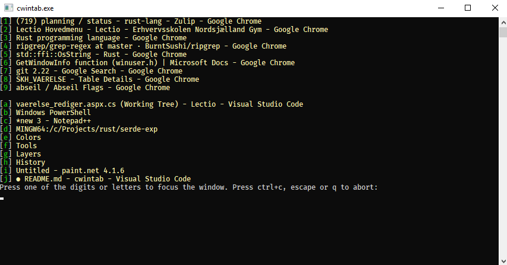

cwintab
-------
cwintab is a command line utility that in some situations make it quicker
to switch between windows on Windows.

### What is wrong with alt-tab?
In most situations, nothing. 
However, when you are using a remote desktop over a connection with quite
high latency and/or somewhat limited bandwidth, it takes a moment to show the
list of recent windows along with their tiles. For me, 1-2 seconds is normal,
and a bit too much.

cwintab also shows a list of recently used windows, but does so in a console
window that naturally contains little graphics, and therefore displays on the
screen quite a bit faster.



### Installation

You will need a [Rust](https://www.rust-lang.org/) installation in order to
build this utility.

1. Clone this repo. 
2. Build and run:

   ```cargo run```

To "install", you will probably want to do the following:

1. Build:

   ```cargo build --release ```

   Now you should have a ```cwintab.exe``` in the target\release folder.

1. Create a windows shortcut to the executable and assign it a shortcut key
so that it can be started easily.  
   I use ctrl+alt+w as keyboard shortcut.
